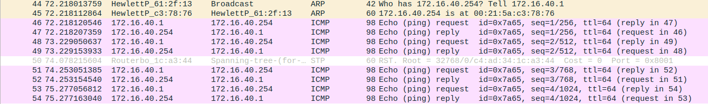

# 2.1 Configurate an IP Network

## Steps

1. Conectar E0 do Tux43 e do Tux44 numa das entradas do switch (TUX43 - porta 1 e TUX44 - porta 2);
2. Aceder a cada um dos computadores e configurar os seus IPs:
 
     ```bash
     $ ifconfig eth0 up
     $ ifconfig eth0 <IP>
         - 172.16.40.1/24 para o Tux43
         - 172.16.40.254/24 para o Tux44
     ```
3. Para ver o MAC address de cada computador, consultar o campo `ether` no comando `ifconfig`;
4. Verificar a conexão dos dois computadores na mesma rede. Em cada um tentar enviar pacotes de dados para o outro. A conexão está correta quando todos os pacotes são recebidos:
 
     ```bash
     $ ping <IP>
         - 172.16.40.254 no Tux43
         - 172.16.40.1 no Tux44
     ```
5. Avaliar a tabela *Address Resolution Protocol* (ARP) do Tux43. Deverá ter uma única entrada com o IP e o MAC do Tux44. Para visualizar a tabela:

   ```bash
     $ arp -a 
   ```

6. Apagar a entrada da tabela ARP do Tux43:
  
     ```bash
     $ arp -d 172.16.40.254/24
     ``` 
   
7. Abrir o WireShark no Tux43 e começar a capturar pacotes de rede;
8. Executar o seguinte comando no Tux43:
 
     ```bash
     $ ping 172.16.40.254/24
     ```
9. Parar a captura dos resultados e avaliar os logs obtidos com o WireShark.
 
   