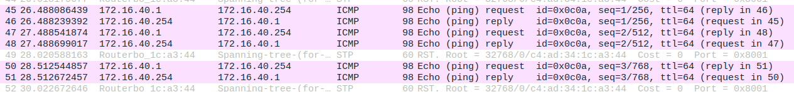
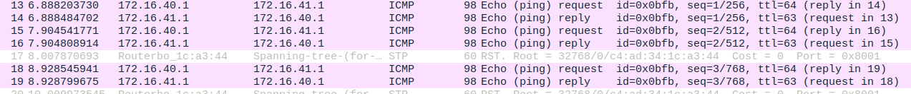
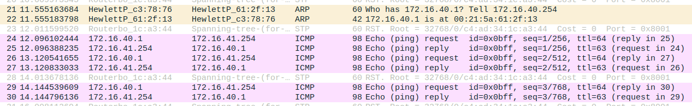
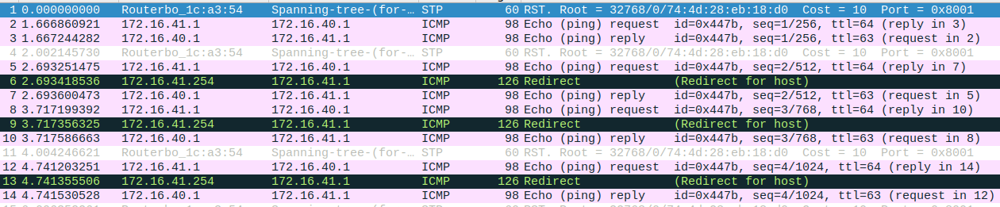

# 2.4 Configure a Commercial Router and Implement NAT

## Steps

1. Ligar eth1 do Router à porta 4.1 da régua

2. Ligar eth2 to Router ao Switch (porta 17)

3. Eliminar as portas default do ether17 do switch e ligar o ether17 à bridge41

```bash
   /interface bridge port remove [find interface=ether17]
   /interface bridge port add bridge=bridge41 interface=ether17
```

4. Trocar o cabo ligado a consola do Switch para o Router

5. No Tux42 conectar ao router desde o GTKterm e resetar as configurações do router

```bash
    /system reset-configuration
```
6. Configurar ip do Router pela consola do router no GTKterm do Tux42

```bash
   /ip address add address=172.16.1.49/24 interface=ether1
   /ip address add address=172.16.41.254/24 interface=ether2
```
7. Configurar as rotas default nos Tuxs e no Router:

```bash
    route add default gw 172.16.41.254 # Tux52
    route add default gw 172.16.40.254 # Tux53
    route add default gw 172.16.41.254 # Tux54

    /ip route add dst-address=172.16.40.0/24 gateway=172.16.41.253  # Router console
    /ip route add dst-address=0.0.0.0/0 gateway=172.16.1.254        # Router console
```
8. No Tux43, começar captura do Wireshark e fazer ping de todas as interfaces. Todas deverão funcionar

- Ping para o Tux44:
   
   ```bash
      ping 172.16.40.254
   ```


- Ping para o Tux42:
   
   ```bash
      ping 172.16.41.1
   ```


- Ping para o router:
      
   ```bash
      ping 172.16.41.254
   ```


9. No Tux42, desativar o *accept_redirects*

```bash
   sysctl net.ipv4.conf.eth0.accept_redirects=0
   sysctl net.ipv4.conf.all.accept_redirects=0 
```
10. Remover a rota que liga Tux42 ao Tux44

   ```bash
      route del -net 172.16.40.0 gw 172.16.41.253 netmask 255.255.255.0
   ```
11. No Tux42, começar captura do wireshark e fazer ping do Tux43. A ligação é estabelecida, usando o Rc como router em vez do Tux44.

   ```bash
      ping 172.16.40.1
   ```


12. Fazendo traceroute, conseguimos verificar o percurso da ligação (RC_eth2 -> Tux44_eth1 -> Tux44_eth0 -> Tux43_eth0)

```bash
   traceroute -n 172.16.50.1
```

13. Adicionar de novo a rota que liga Tux42 ao Tux44

```bash
    route add -net 172.16.40.0/24 gw 172.16.41.253 
```

14. No Tux42, traceroute para o Tux43 
   
   ```bash
      traceroute -n 172.16.40.1
   ```

   ```note
      O Tux42 já não vai buscar informação ao router, mas sim ao Tux44
   ```

15. No Tux42, reativar o *accept_redirects*

```bash
   sysctl net.ipv4.conf.eth0.accept_redirects=1
   sysctl net.ipv4.conf.all.accept_redirects=1
```

16. No Tux43, fazer ping do router do lab I.320 para verificar a ligação

```bash
    ping 172.16.2.254
```

17. Desativar NAT do Router

```bash
    /ip firewall nat disable 0
```

18. No Tux43, fazer de novo ping do router do lab I.320 para verificar a ligação. Verifica-se que não há ligação:

```bash
    ping 172.16.2.254
```

19. Reativar Nat do Router

```bash
    /ip firewall nat enable 0
```
