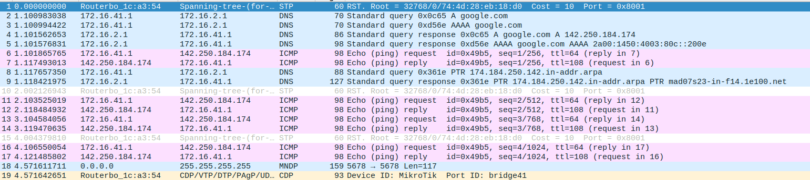
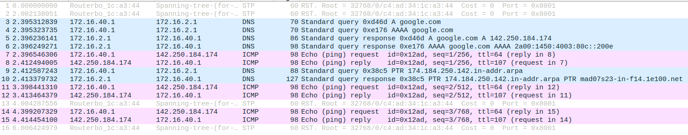
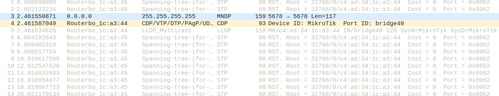
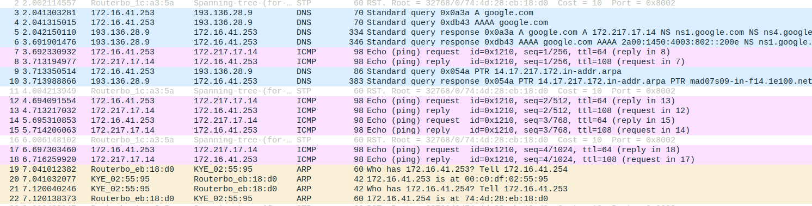

# 2.5 - DNS

## Steps

1. Em todos os Tuxs, adicionar a seguinte linha ao ficheiro /etc/resolv.conf

```note
   nameserver 172.16.1.1
```
2. Em todos os Tux, fazer ping do google para verificar se podem ser usados nomes como host

```bash
   ping google.com
```

- Tux42:


- Tux43:


- Tux44_eth0:


- Tux44_eth1:

